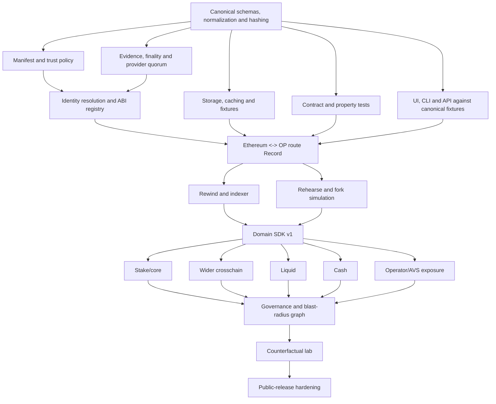

# D-006 — Asymmetric parallelism: one semantic-spine owner, independent research and verification lanes

## Context
Owner directive (2026-07-21) sets the parallelism doctrine for Aegis. This fires IDEA-001's
trigger: the control plane now needs per-agent claims. Amends [[D-005]] contract item 4 —
the lease model v1 exists; concurrent *committing* writers additionally require separate
worktrees/branches per writer before launch.

## Doctrine
**The best parallelism for Aegis is asymmetric: one owner protects the semantic spine;
multiple agents independently research sources, build adapters, attack assumptions, and
later deliver whole domain slices. Maximum agent count is not the goal. Independent evidence
and verification are.**

### Single-owner surfaces (never parallelized)
Canonical truth/availability states · observation/provenance semantics · hash normalization
rules · shared identifier namespaces · manifest promotion rules · Domain SDK changes · final
integration and milestone acceptance. W1 (canonical report contract) has ONE implementation
owner. Also: one frontend writer until the 889-line dashboard component is decomposed into
feature-owned modules (shell, Atlas, evidence drawer, Rewind, Rehearse).

### Independence rule (the evidentiary core)
Never let the same agent (a) source an expected value, (b) implement the check that reads
the observed value, and (c) certify the check correct. Expected-policy researchers (WR1/WR2)
are barred from implementing observed-RPC acquisition (W3+); adversarial-vector design (WR6)
proceeds without reading W1's implementation.

## Execution map (dependency-aware)

Wave plan: M1 lanes (manifest/trust · provider/finality/quorum · storage/cache · contract
tests · fixture-consumer transports) serialize at identity/ABI (W4). M2 splits route
observation, pure predicates, expected manifest, topology UI, adversarial suite, scheduled
capture — serialized at one real ETH<->OP report agreeing across all surfaces. M3/M4 overlap;
they meet at the shared semantic-diff and implementation-epoch contracts. After M4, freeze a
Domain SDK, then vertically-owned domain pods (research -> manifest -> observer -> evaluator
-> fixtures -> Record -> Rewind -> Rehearse -> UI projection). Review roles run parallel
throughout: clean-room hash reproducer, adversarial mutation tester, provenance reviewer,
ABI/identity reviewer, renderer-semantics reviewer, clean-clone demo operator, threat-model
attacker.

## Claims model v1 (implements this)
- `roadmap/claims/CLAIM-<agent>.md`: agent, task, lease, base_commit, optional narrowed
  allowed_paths (must be a subset of the task's).
- WIP=1 is PER AGENT; every active work item needs exactly one active unexpired claim
  (doctor-enforced); scope gate resolves an agent lane via AEGIS_AGENT from the staged index.
- STATUS.active_task remains the integration/orchestrator lane pointer.
- Research/read-only lanes may begin immediately; concurrent committing writers additionally
  need per-writer worktrees and branches (not yet provisioned).

## Consequences
- Six research lanes (WR1–WR6) are chartered as work items with provenance-first acceptance.
- Doctor drops the single-global-active-task rule in favor of claim accountability.
